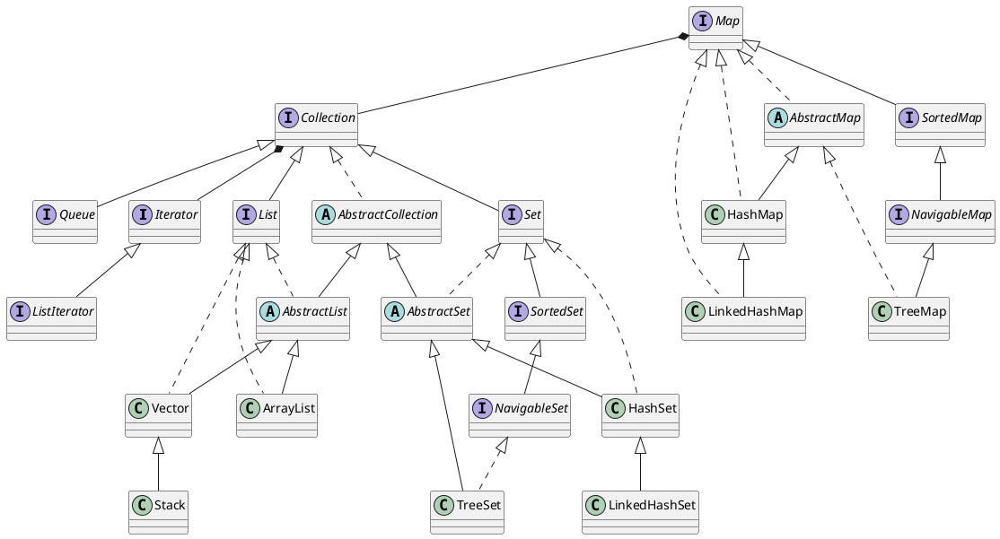

# 集合

```plantuml
@startuml
interface Iterator {}

interface ListIterator {}
Iterator <|-- ListIterator

interface Collection {}
Collection *-- Iterator

abstract class AbstractCollection {}
Collection <|.. AbstractCollection

interface List {}
Collection <|-- List

abstract class AbstractList {}
List <|.. AbstractList
AbstractCollection <|-- AbstractList

class Vector {}
AbstractList <|-- Vector
List <|.. Vector

class Stack {}
Vector <|-- Stack

class ArrayList {}
AbstractList <|-- ArrayList
List <|.. ArrayList

interface Set {}
Collection <|-- Set

abstract class AbstractSet {}
AbstractCollection <|-- AbstractSet
Set <|.. AbstractSet

class HashSet {}
AbstractSet <|-- HashSet
Set <|.. HashSet

class LinkedHashSet {}
HashSet <|-- LinkedHashSet

interface SortedSet {}
Set <|-- SortedSet

interface NavigableSet {}
SortedSet <|-- NavigableSet

class TreeSet {}
AbstractSet <|-- TreeSet
NavigableSet <|.. TreeSet

interface Queue {}
Collection <|-- Queue

interface Map {}
Map *-- Collection

abstract class AbstractMap {}
Map <|.. AbstractMap

class HashMap {}
Map <|.. HashMap
AbstractMap <|-- HashMap

class LinkedHashMap {}
HashMap <|-- LinkedHashMap
Map <|.. LinkedHashMap

interface SortedMap {}
Map <|-- SortedMap

interface NavigableMap {}
SortedMap <|-- NavigableMap

class TreeMap {}
NavigableMap <|-- TreeMap
AbstractMap <|.. TreeMap
@enduml
```
